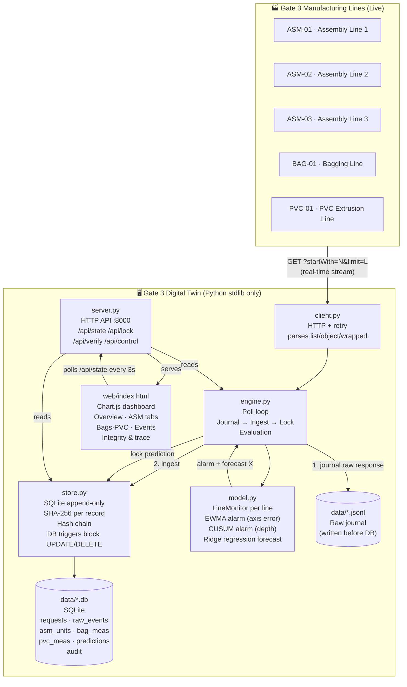
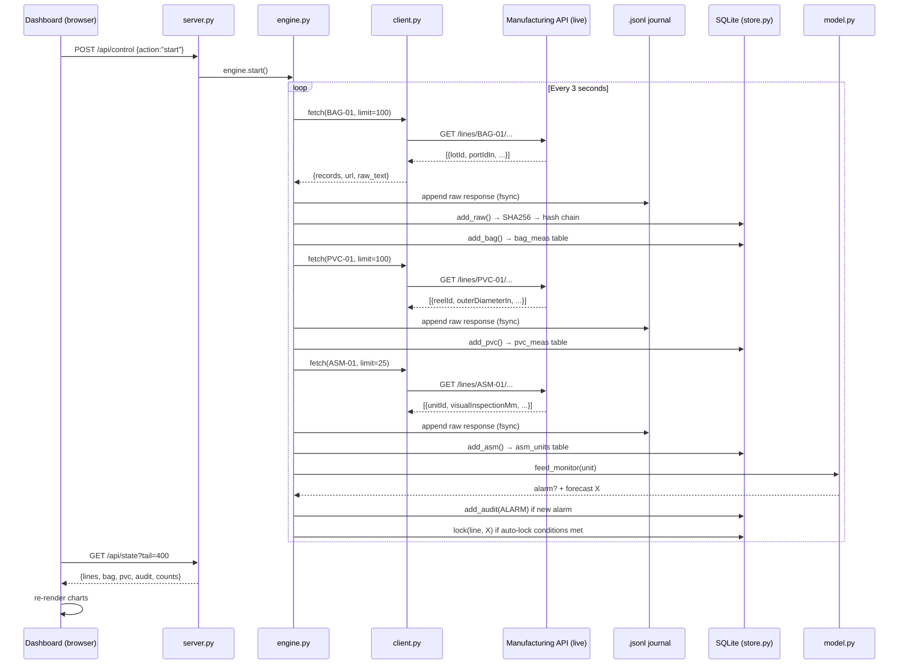
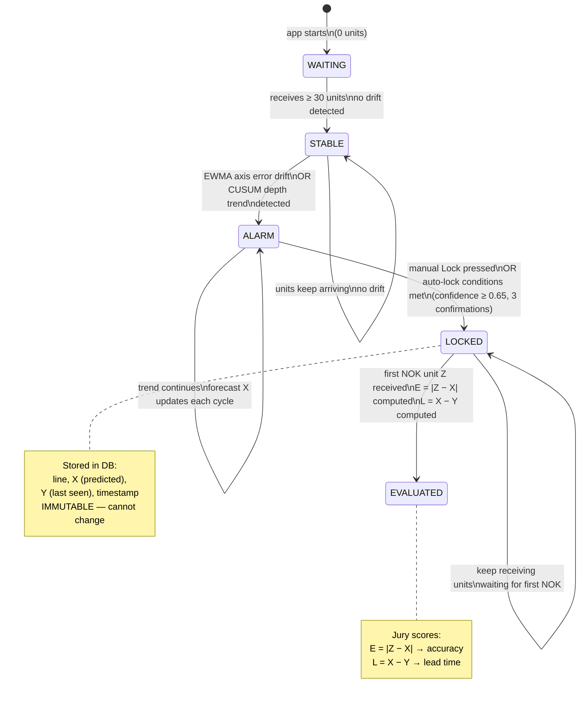
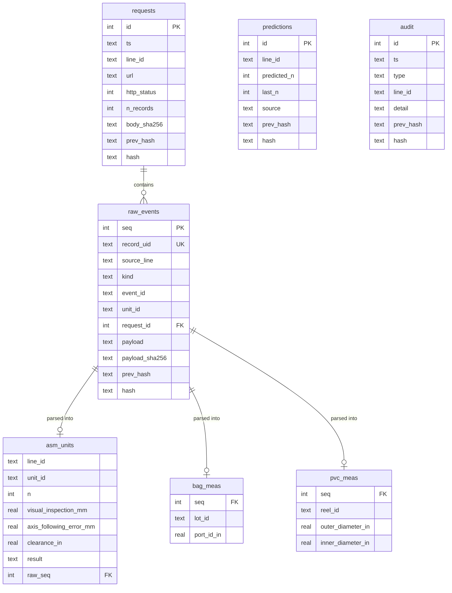

# Gate 3 · Digital Twin — All Diagrams

---

## 1. Architecture

```mermaid
graph TB
    subgraph Factory["🏭 Gate 3 Manufacturing Lines (Live)"]
        S1["ASM-01 · Assembly Line 1"]
        S2["ASM-02 · Assembly Line 2"]
        S3["ASM-03 · Assembly Line 3"]
        S4["BAG-01 · Bagging Line"]
        S5["PVC-01 · PVC Extrusion Line"]
    end

    subgraph App["🖥️ Gate 3 Digital Twin (Python stdlib only)"]
        CL["client.py\nHTTP + retry\nparses list/object/wrapped"]
        EN["engine.py\nPoll loop\nJournal → Ingest → Lock\nEvaluation"]
        ST["store.py\nSQLite append-only\nSHA-256 per record\nHash chain\nDB triggers block UPDATE/DELETE"]
        MO["model.py\nLineMonitor per line\nEWMA alarm (axis error)\nCUSUM alarm (depth)\nRidge regression forecast"]
        SV["server.py\nHTTP API :8000\n/api/state  /api/lock\n/api/verify  /api/control"]
        WEB["web/index.html\nChart.js dashboard\nOverview · ASM tabs\nBags·PVC · Events\nIntegrity & trace"]
        JNL[("data/*.jsonl\nRaw journal\n(written before DB)")]
        DB[("data/*.db\nSQLite\nrequests · raw_events\nasm_units · bag_meas\npvc_meas · predictions\naudit")]
    end

    Factory -->|"GET ?startWith=N&limit=L\n(real-time stream)"| CL
    CL --> EN
    EN -->|"1. journal raw response"| JNL
    EN -->|"2. ingest"| ST
    ST --> DB
    EN --> MO
    MO -->|"alarm + forecast X"| EN
    EN -->|"lock prediction"| ST
    SV -->|"reads"| ST
    SV -->|"reads"| EN
    SV -->|"serves"| WEB
    WEB -->|"polls /api/state every 3s"| SV
```

---

## 2. Data Flow (one polling cycle)

```mermaid
sequenceDiagram
    participant UI as Dashboard (browser)
    participant SV as server.py
    participant EN as engine.py
    participant CL as client.py
    participant MFG as Manufacturing API (live)
    participant JNL as .jsonl journal
    participant DB as SQLite (store.py)
    participant MO as model.py

    UI->>SV: POST /api/control {action:"start"}
    SV->>EN: engine.start()

    loop Every 3 seconds
        EN->>CL: fetch(BAG-01, limit=100)
        CL->>MFG: GET /lines/BAG-01/...
        MFG-->>CL: [{lotId, portIdIn, ...}]
        CL-->>EN: {records, url, raw_text}
        EN->>JNL: append raw response (fsync)
        EN->>DB: add_raw() → SHA256 → hash chain
        EN->>DB: add_bag() → bag_meas table

        EN->>CL: fetch(PVC-01, limit=100)
        CL->>MFG: GET /lines/PVC-01/...
        MFG-->>CL: [{reelId, outerDiameterIn, ...}]
        EN->>JNL: append raw response (fsync)
        EN->>DB: add_pvc() → pvc_meas table

        EN->>CL: fetch(ASM-01, limit=25)
        CL->>MFG: GET /lines/ASM-01/...
        MFG-->>CL: [{unitId, visualInspectionMm, ...}]
        EN->>JNL: append raw response (fsync)
        EN->>DB: add_asm() → asm_units table
        EN->>MO: feed_monitor(unit)
        MO-->>EN: alarm? + forecast X
        EN->>DB: add_audit(ALARM) if new alarm
        EN->>DB: lock(line, X) if auto-lock conditions met
    end

    UI->>SV: GET /api/state?tail=400
    SV-->>UI: {lines, bag, pvc, audit, counts}
    UI->>UI: re-render charts
```

---

## 3. Prediction State Machine

```mermaid
stateDiagram-v2
    [*] --> WAITING : app starts\n(0 units)

    WAITING --> STABLE : receives ≥ 30 units\nno drift detected

    STABLE --> ALARM : EWMA axis error drift\nOR CUSUM depth trend\ndetected

    ALARM --> ALARM : trend continues\nforecast X updates each cycle

    ALARM --> LOCKED : manual Lock pressed\nOR auto-lock conditions met\n(confidence ≥ 0.65, 3 confirmations)

    LOCKED --> LOCKED : keep receiving units\nwaiting for first NOK

    LOCKED --> EVALUATED : first NOK unit Z received\nE = |Z − X| computed\nL = X − Y computed

    STABLE --> STABLE : units keep arriving\nno drift

    note right of LOCKED
        Stored in DB:
        line, X (predicted),
        Y (last seen), timestamp
        IMMUTABLE — cannot change
    end note

    note right of EVALUATED
        Jury scores:
        E = |Z − X| → accuracy
        L = X − Y  → lead time
    end note
```

---

## 4. Database Schema (ER)

```mermaid
erDiagram
    requests {
        int id PK
        text ts
        text line_id
        text url
        int http_status
        int n_records
        text body_sha256
        text prev_hash
        text hash
    }
    raw_events {
        int seq PK
        text record_uid UK
        text source_line
        text kind
        text event_id
        text unit_id
        int request_id FK
        text payload
        text payload_sha256
        text prev_hash
        text hash
    }
    asm_units {
        text line_id
        text unit_id
        int n
        real visual_inspection_mm
        real axis_following_error_mm
        real clearance_in
        text result
        int raw_seq FK
    }
    bag_meas {
        int seq FK
        text lot_id
        real port_id_in
    }
    pvc_meas {
        int seq FK
        text reel_id
        real outer_diameter_in
        real inner_diameter_in
    }
    predictions {
        int id PK
        text line_id
        int predicted_n
        int last_n
        text source
        text prev_hash
        text hash
    }
    audit {
        int id PK
        text ts
        text type
        text line_id
        text detail
        text prev_hash
        text hash
    }

    requests ||--o{ raw_events : "contains"
    raw_events ||--o| asm_units : "parsed into"
    raw_events ||--o| bag_meas : "parsed into"
    raw_events ||--o| pvc_meas : "parsed into"
```
